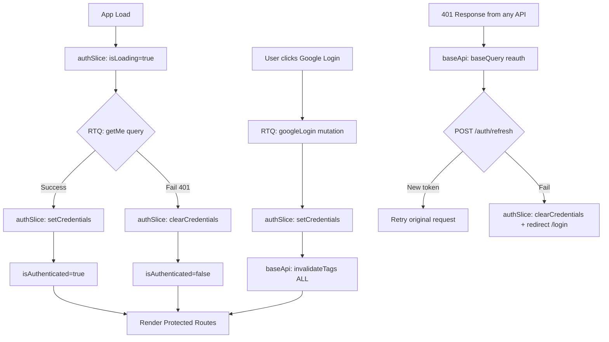
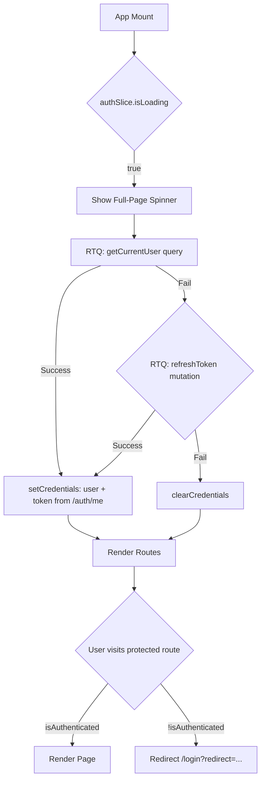

# PetVerse Frontend Architecture

> **Platform:** Pet Adoption & Rehoming Platform  
> **Tech Stack:** React 19 + Vite + Tailwind CSS + Redux Toolkit + RTK Query + React Router DOM + React Hook Form + Framer Motion + React Icons  
> **Backend API:** Express.js REST API (7 modules, base URL `/api/v1`)  
> **Date:** 2026-06-10  

---

## Table of Contents

1. [Folder Structure](#1-folder-structure)
2. [Route Structure](#2-route-structure)
3. [Layout Structure](#3-layout-structure)
4. [Redux Architecture](#4-redux-architecture)
5. [RTK Query Architecture](#5-rtk-query-architecture)
6. [Component Architecture](#6-component-architecture)
7. [Page Architecture](#7-page-architecture)
8. [Protected Route Strategy](#8-protected-route-strategy)
9. [Admin Route Strategy](#9-admin-route-strategy)
10. [Error Boundary Strategy](#10-error-boundary-strategy)
11. [Loading State Strategy](#11-loading-state-strategy)
12. [Toast Notification Strategy](#12-toast-notification-strategy)
13. [API Response Mapping](#13-api-response-mapping)
14. [Future-Ready Module Slots](#14-future-ready-module-slots)

---

## 1. Folder Structure

```
client/
├── index.html
├── package.json
├── vite.config.js
├── tailwind.config.js
├── postcss.config.js
├── .env.example
├── public/
│   ├── favicon.svg
│   ├── og-image.png
│   └── robots.txt
├── src/
│   ├── main.jsx                          # Vite entry + Redux Provider + RouterProvider + ToastContainer
│   ├── App.jsx                           # Root layout shell (Outlet-based)
│   ├── index.css                         # Tailwind directives + global resets + custom utilities
│   │
│   ├── assets/
│   │   ├── images/                       # Static images (hero, empty-states, logos)
│   │   │   ├── hero-pets.webp
│   │   │   ├── empty-saved.svg
│   │   │   └── logo.svg
│   │   └── icons/                        # SVG icon components (when react-icons insufficient)
│   │
│   ├── config/
│   │   ├── constants.js                  # APP_NAME, API_BASE_URL, GOOGLE_CLIENT_ID, SPECIES, SIZES, etc.
│   │   ├── routes.js                     # Route path constants (ROUTES.HOME, ROUTES.PETS, etc.)
│   │   └── tailwind.js                   # Custom Tailwind theme extensions (colors, fonts)
│   │
│   ├── store/
│   │   ├── index.js                      # configureStore() — combines reducers + middleware
│   │   ├── api/
│   │   │   ├── baseApi.js                # createApi() with fetchBaseQuery, reauth logic, tagTypes
│   │   │   ├── authApi.js                # login, logout, refresh, getMe
│   │   │   ├── petApi.js                 # CRUD pets, featured, search, view increment
│   │   │   ├── userApi.js                # profile, updateProfile, deleteAccount, userListings
│   │   │   ├── savedPetApi.js            # toggle, list, check, unsave
│   │   │   ├── reportApi.js              # create, myReports, delete
│   │   │   ├── uploadApi.js              # single, multiple, delete
│   │   │   └── adminApi.js               # dashboard, users, pets, reports, toggleStatus, toggleFeature
│   │   └── slices/
│   │       ├── authSlice.js              # user, accessToken, isAuthenticated
│   │       ├── uiSlice.js                # theme, mobileMenuOpen, filterDrawerOpen, globalLoading
│   │       ├── filterSlice.js            # searchQuery, species, listingType, size, gender, sort, page
│   │       └── toastSlice.js             # toasts[] array — { id, type, message, duration }
│   │
│   ├── hooks/
│   │   ├── useAuth.js                    # login/logout flows, Google OAuth callback, token refresh
│   │   ├── useDebounce.js                # Debounced value hook (search input)
│   │   ├── useInfiniteScroll.js          # Intersection Observer + page increment
│   │   ├── useMediaQuery.js              # Responsive breakpoint detection
│   │   ├── useImageUpload.js             # Cloudinary upload via backend proxy
│   │   ├── useScrollToTop.js             # Scroll reset on route change
│   │   └── useFormSubmit.js              # React Hook Form + RTK Query mutation wrapper
│   │
│   ├── router/
│   │   ├── AppRouter.jsx                 # createBrowserRouter with route tree
│   │   ├── ProtectedRoute.jsx            # Auth gate wrapper
│   │   ├── AdminRoute.jsx                # Auth + role=admin gate wrapper
│   │   └── GuestRoute.jsx                # Redirects authenticated users away from /login
│   │
│   ├── components/
│   │   ├── common/
│   │   │   ├── Button.jsx                # Variants: primary, secondary, outline, danger, ghost, sizes
│   │   │   ├── Input.jsx                 # Label + error message + icon slot
│   │   │   ├── Select.jsx                # Accessible dropdown with search
│   │   │   ├── Modal.jsx                 # AnimatePresence + portal + focus trap
│   │   │   ├── Card.jsx                  # Hover elevation + Framer Motion
│   │   │   ├── Badge.jsx                 # Species, status, listing type badges
│   │   │   ├── Spinner.jsx               # Sizes: sm, md, lg; centered or inline
│   │   │   ├── Toast.jsx                 # Single toast: icon + message + dismiss
│   │   │   ├── ToastContainer.jsx        # Fixed bottom-right stack (Framer Motion AnimatePresence)
│   │   │   ├── EmptyState.jsx            # Icon + title + subtitle + optional CTA
│   │   │   ├── ConfirmDialog.jsx         # Modal variant: title + message + confirm/cancel
│   │   │   ├── ImageUploader.jsx         # Drag-drop zone + preview + progress bar
│   │   │   ├── SearchBar.jsx             # Debounced input + icon + clear button
│   │   │   ├── Pagination.jsx            # Page numbers + prev/next + total info
│   │   │   ├── FilterPanel.jsx           # Sidebar/modal with species, size, gender, listingType
│   │   │   ├── FilterChips.jsx           # Active filter tags with x-remove
│   │   │   ├── Skeleton.jsx              # Generic skeleton lines + PetCardSkeleton variant
│   │   │   ├── ErrorFallback.jsx         # Error boundary UI: icon + message + retry button
│   │   │   ├── SEO.jsx                   # react-helmet-async wrapper
│   │   │   └── LazyImage.jsx             # Blur-up lazy loaded image with IntersectionObserver
│   │   │
│   │   ├── layout/
│   │   │   ├── MainLayout.jsx            # Header + Outlet + Footer + MobileNav
│   │   │   ├── AdminLayout.jsx           # AdminSidebar + AdminHeader + Outlet
│   │   │   ├── Header.jsx                # Logo + NavLinks + SearchBar + UserMenu
│   │   │   ├── Footer.jsx                # Links + copyright + social
│   │   │   ├── MobileNav.jsx             # Bottom tab bar (Home, Browse, Saved, Profile)
│   │   │   ├── AdminSidebar.jsx          # Collapsible: Dashboard, Users, Pets, Reports
│   │   │   ├── AdminHeader.jsx           # Breadcrumb + admin name + logout
│   │   │   └── UserMenu.jsx              # Avatar dropdown: Profile, My Listings, Settings, Logout
│   │   │
│   │   ├── auth/
│   │   │   └── GoogleLoginButton.jsx     # Google OAuth 2.0 sign-in button
│   │   │
│   │   ├── pet/
│   │   │   ├── PetCard.jsx               # Image + name + species badge + location + price + save btn
│   │   │   ├── PetCardSkeleton.jsx       # Pulse animation placeholder
│   │   │   ├── PetGrid.jsx               # Responsive grid: 1col mobile / 2col tablet / 3col desktop
│   │   │   ├── PetImageCarousel.jsx      # Swipeable image gallery with thumbnails
│   │   │   ├── PetInfo.jsx               # Species, breed, age, gender, size, color, health
│   │   │   ├── PetForm.jsx               # Create/Edit form (React Hook Form + Joi-like validation)
│   │   │   ├── PetContactCard.jsx        # Owner info + preferred contact method
│   │   │   ├── SaveButton.jsx            # Heart icon toggle (optimistic update)
│   │   │   ├── ListingTypeBadge.jsx      # Adoption / Rehoming / Sale / Lost / Found
│   │   │   ├── ReportButton.jsx          # Opens Report modal
│   │   │   └── ShareButton.jsx           # Web Share API / copy link
│   │   │
│   │   ├── user/
│   │   │   ├── UserAvatar.jsx            # Image or initials fallback
│   │   │   ├── ProfileCard.jsx           # Avatar + name + bio + location + stats
│   │   │   ├── ProfileForm.jsx           # Edit name, bio, phone, location, avatar
│   │   │   └── SettingsForm.jsx          # Account deletion, preferences
│   │   │
│   │   └── admin/
│   │       ├── StatsCard.jsx             # Icon + label + value + trend arrow
│   │       ├── DataTable.jsx             # Sortable columns + pagination + row actions
│   │       ├── UserRow.jsx               # Avatar + name + email + role badge + toggle active
│   │       ├── PetRow.jsx                # Thumbnail + name + owner + status + feature toggle
│   │       └── ReportRow.jsx             # Reason + pet + reporter + status badge + actions
│   │
│   ├── pages/
│   │   ├── HomePage.jsx                  # Hero + Featured Pets + Category Quick Links + CTA
│   │   ├── BrowsePetsPage.jsx            # FilterPanel + PetGrid + Pagination/InfiniteScroll
│   │   ├── PetDetailPage.jsx             # ImageCarousel + PetInfo + ContactCard + SimilarPets
│   │   ├── LostFoundPage.jsx             # Filtered browse (listingType=lost|found) + map placeholder
│   │   ├── LoginPage.jsx                 # GoogleLoginButton + decorative illustration
│   │   ├── RegisterPage.jsx              # Same as Login (Google OAuth only) + info text
│   │   ├── CreateListingPage.jsx         # PetForm (create mode)
│   │   ├── EditListingPage.jsx           # PetForm (edit mode, pre-populated)
│   │   ├── ProfilePage.jsx               # Public user profile + their listings
│   │   ├── MyListingsPage.jsx            # Current user's listings with status badges
│   │   ├── SavedPetsPage.jsx             # Grid of saved pets with unsave button
│   │   ├── SettingsPage.jsx              # ProfileForm + danger zone (delete account)
│   │   ├── NotFoundPage.jsx              # 404 illustration + go home CTA
│   │   └── admin/
│   │       ├── AdminDashboardPage.jsx    # 4 StatsCards + recent activity
│   │       ├── AdminUsersPage.jsx        # DataTable with UserRow
│   │       ├── AdminPetsPage.jsx         # DataTable with PetRow
│   │       └── AdminReportsPage.jsx      # DataTable with ReportRow + review actions
│   │
│   └── utils/
│       ├── cn.js                         # clsx + tailwind-merge utility
│       ├── formatters.js                 # formatDate, formatPrice, formatAge, truncateText
│       ├── validators.js                 # Client-side validation schemas (mirrors Joi server rules)
│       ├── storage.js                    # localStorage get/set/remove with JSON parse safety
│       └── errorUtils.js                 # extractErrorMessage(), isNetworkError(), isAuthError()
```

---

## 2. Route Structure

### 2.1 Route Tree (React Router v6 createBrowserRouter)

```
<AppRouter>
├── <MainLayout>                              # Public shell: Header + Outlet + Footer + MobileNav
│   ├── index: "/"                            → HomePage                     (public)
│   ├── path: "pets"                          → BrowsePetsPage               (public)
│   ├── path: "pets/:id"                      → PetDetailPage                (public)
│   ├── path: "lost-found"                    → LostFoundPage                (public)
│   ├── path: "login"                         → LoginPage                    (guest only)
│   ├── path: "register"                      → RegisterPage                 (guest only)
│   ├── path: "profile/:id"                   → ProfilePage                  (public)
│   │
│   ├── <ProtectedRoute>                      # Requires access token
│   │   ├── path: "pets/new"                  → CreateListingPage            (auth)
│   │   ├── path: "pets/:id/edit"             → EditListingPage              (auth + owner)
│   │   ├── path: "saved"                     → SavedPetsPage                (auth)
│   │   ├── path: "my-listings"               → MyListingsPage               (auth)
│   │   ├── path: "settings"                  → SettingsPage                 (auth)
│   │   └── path: "reports"                   → MyReportsPage                (auth)
│   │
│   └── path: "*"                             → NotFoundPage                 (public)
│
├── <AdminLayout>                              # Admin shell: sidebar + header + outlet
│   └── <AdminRoute>                           # Requires auth + role=admin
│       ├── index: "admin"                     → AdminDashboardPage           (admin)
│       ├── path: "admin/users"                → AdminUsersPage               (admin)
│       ├── path: "admin/pets"                 → AdminPetsPage                (admin)
│       └── path: "admin/reports"              → AdminReportsPage             (admin)
```

### 2.2 Route Path Constants

```js
// src/config/routes.js
export const ROUTES = {
  HOME: '/',
  PETS: '/pets',
  PET_DETAIL: '/pets/:id',
  PET_CREATE: '/pets/new',
  PET_EDIT: '/pets/:id/edit',
  LOST_FOUND: '/lost-found',
  LOGIN: '/login',
  REGISTER: '/register',
  PROFILE: '/profile/:id',
  SAVED: '/saved',
  MY_LISTINGS: '/my-listings',
  SETTINGS: '/settings',
  MY_REPORTS: '/reports',
  ADMIN: {
    DASHBOARD: '/admin',
    USERS: '/admin/users',
    PETS: '/admin/pets',
    REPORTS: '/admin/reports',
  },
};

export const build = {
  petDetail: (id) => `/pets/${id}`,
  petEdit: (id) => `/pets/${id}/edit`,
  profile: (id) => `/profile/${id}`,
};
```

### 2.3 Route-to-API Mapping

| Route | API Endpoint | RTK Query Hook |
|-------|-------------|----------------|
| HomePage (Featured) | `GET /api/v1/pets/featured` | `useGetFeaturedPetsQuery()` |
| BrowsePetsPage | `GET /api/v1/pets?page=&limit=&species=&listingType=&size=&gender=&sort=&search=` | `useGetPetsQuery(filters)` |
| PetDetailPage | `GET /api/v1/pets/:id` | `useGetPetByIdQuery(id)` |
| PetDetailPage (view) | `POST /api/v1/pets/:id/view` | `useIncrementViewMutation()` |
| PetDetailPage (save check) | `GET /api/v1/saved-pets/check/:petId` | `useCheckSavedQuery(petId)` |
| CreateListingPage | `POST /api/v1/pets` | `useCreatePetMutation()` |
| CreateListingPage (images) | `POST /api/v1/upload/multiple` | `useUploadMultipleMutation()` |
| EditListingPage | `PATCH /api/v1/pets/:id` | `useUpdatePetMutation()` |
| LostFoundPage | `GET /api/v1/pets?listingType=lost,found` | `useGetPetsQuery(...)` |
| LoginPage | `POST /api/v1/auth/google` | `useGoogleLoginMutation()` |
| SavedPetsPage | `GET /api/v1/saved-pets` | `useGetSavedPetsQuery()` |
| SavedPetsPage (toggle) | `POST /api/v1/saved-pets` | `useToggleSaveMutation()` |
| MyListingsPage | `GET /api/v1/users/:id/listings` | `useGetUserListingsQuery()` |
| ProfilePage | `GET /api/v1/users/:id` | `useGetPublicProfileQuery(id)` |
| SettingsPage | `PATCH /api/v1/users/profile` | `useUpdateProfileMutation()` |
| SettingsPage (delete) | `DELETE /api/v1/users/account` | `useDeleteAccountMutation()` |
| Header (current user) | `GET /api/v1/auth/me` | `useGetCurrentUserQuery()` |
| AdminDashboardPage | `GET /api/v1/admin/dashboard` | `useGetDashboardQuery()` |
| AdminUsersPage | `GET /api/v1/admin/users` | `useGetAdminUsersQuery()` |
| AdminPetsPage | `GET /api/v1/admin/pets` | `useGetAdminPetsQuery()` |
| AdminReportsPage | `GET /api/v1/admin/reports` | `useGetAdminReportsQuery()` |

---

## 3. Layout Structure

### 3.1 MainLayout (Public + Authenticated User Pages)

```
┌──────────────────────────────────────────────────┐
│ Header                                            │
│ ┌──────┐ ┌──────────────┐ ┌─────────────────────┐│
│ │ Logo │ │  Nav Links   │ │ SearchBar + UserMenu ││
│ └──────┘ └──────────────┘ └─────────────────────┘│
├──────────────────────────────────────────────────┤
│                                                    │
│                    <Outlet />                       │
│              (Page content here)                    │
│                                                    │
├──────────────────────────────────────────────────┤
│ Footer                                            │
├──────────────────────────────────────────────────┤
│ MobileNav (visible on <md)                        │
│ ┌─────────┬─────────┬─────────┬─────────────────┐│
│ │  Home   │ Browse  │  Saved  │    Profile      ││
│ └─────────┴─────────┴─────────┴─────────────────┘│
└──────────────────────────────────────────────────┘
```

**Implementation:** [`src/components/layout/MainLayout.jsx`](client/src/components/layout/MainLayout.jsx)

- Uses `<Outlet />` from React Router for nested route rendering
- Scrolls to top on route change via `useScrollToTop()` hook
- Header is sticky on scroll (Tailwind `sticky top-0 z-50`)
- MobileNav is a fixed bottom bar (Tailwind `fixed bottom-0 md:hidden`)
- Footer is below the fold, always at bottom via flex `min-h-screen` layout

### 3.2 AdminLayout (Admin Pages)

```
┌──────┬───────────────────────────────────────────┐
│      │ AdminHeader                                │
│      │ ┌──────────────────────┬─────────────────┐│
│ Admin│ │  Breadcrumb           │  Admin Name     ││
│ Side │ │  Dashboard > Users    │  Logout         ││
│ bar  │ └──────────────────────┴─────────────────┘│
│      ├───────────────────────────────────────────┤
│ ┌───┐│                                            │
│ │ D ││              <Outlet />                     │
│ │ U ││         (Admin page content)                │
│ │ P ││                                            │
│ │ R ││                                            │
│ │   ││                                            │
│ └───┘│                                            │
└──────┴───────────────────────────────────────────┘
```

**Implementation:** [`src/components/layout/AdminLayout.jsx`](client/src/components/layout/AdminLayout.jsx)

- Sidebar is collapsible on desktop, hidden on mobile (hamburger toggle)
- AdminSidebar items: Dashboard (LayoutDashboard icon), Users (Users), Pets (PawPrint), Reports (Flag)
- Active route highlighted via `useLocation()` matching
- Sidebar width: 250px expanded, 64px collapsed (icons only)

### 3.3 Layout Composition Tree

```
MainLayout
├── Header
│   ├── Logo (Link to /)
│   ├── NavLinks (Home, Browse, Lost & Found)
│   ├── SearchBar (navigates to /pets?search=...)
│   └── UserMenu
│       ├── (if !auth) → "Login" button
│       └── (if auth) → UserAvatar dropdown
│           ├── Profile
│           ├── My Listings
│           ├── Saved Pets
│           ├── Settings
│           ├── ──────────
│           └── Logout
├── <Outlet />
├── Footer
└── MobileNav (4 tabs)

AdminLayout
├── AdminSidebar
│   ├── Dashboard
│   ├── Users
│   ├── Pets
│   └── Reports
├── AdminHeader
│   ├── Breadcrumb
│   └── User Menu + Logout
└── <Outlet />
```

---

## 4. Redux Architecture

### 4.1 Store Configuration

```js
// src/store/index.js
import { configureStore } from '@reduxjs/toolkit';
import { baseApi } from './api/baseApi';
import authReducer from './slices/authSlice';
import uiReducer from './slices/uiSlice';
import filterReducer from './slices/filterSlice';
import toastReducer from './slices/toastSlice';

export const store = configureStore({
  reducer: {
    [baseApi.reducerPath]: baseApi.reducer,
    auth: authReducer,
    ui: uiReducer,
    filter: filterReducer,
    toast: toastReducer,
  },
  middleware: (getDefaultMiddleware) =>
    getDefaultMiddleware().concat(baseApi.middleware),
  devTools: import.meta.env.DEV,
});
```

### 4.2 Slice Design

#### authSlice — Authentication State

```js
// Initial State
{
  user: null,              // { _id, name, email, avatar, role, location }
  accessToken: null,       // JWT string (15min expiry)
  isAuthenticated: false,
  isLoading: true,         // True during token validation on app load
}

// Reducers
setCredentials(user, accessToken)
clearCredentials()
setLoading(bool)

// Selectors
selectCurrentUser(state)
selectIsAuthenticated(state)
selectIsAdmin(state)          // state.auth.user?.role === 'admin'
selectAccessToken(state)
selectAuthLoading(state)
```

#### uiSlice — UI State

```js
// Initial State
{
  theme: 'light',                // 'light' | 'dark' (future-ready)
  mobileMenuOpen: false,
  filterDrawerOpen: false,
  globalLoading: false,          // Full-page loading overlay
  adminSidebarCollapsed: false,
}

// Reducers
toggleTheme()
setMobileMenuOpen(bool)
toggleFilterDrawer()
setGlobalLoading(bool)
toggleAdminSidebar()
```

#### filterSlice — Search/Filter Persistence

```js
// Initial State
{
  search: '',
  species: [],                   // ['dog', 'cat']
  listingType: [],               // ['adoption', 'rehoming']
  size: [],
  gender: [],
  ageMin: null,
  ageMax: null,
  priceMin: null,
  priceMax: null,
  sort: '-createdAt',            // Default: newest first
  page: 1,
  limit: 12,
}

// Reducers
setSearch(value)
setFilter({ key, value })
toggleFilterValue({ key, value })  // Toggle array filters
clearAllFilters()
setPage(n)
setSort(sortValue)
resetFilters()                      // Back to initial state
```

#### toastSlice — Toast Notifications

```js
// Initial State
{
  toasts: [],                    // { id, type, message, duration }
}

// Reducers
addToast({ type, message, duration? })   // Auto-generates unique id
removeToast(id)
clearToasts()

// Action creator helper
showToast = (message, type = 'success') => addToast({ type, message })
```

### 4.3 State Flow Diagram



---

## 5. RTK Query Architecture

### 5.1 Base API Configuration

```js
// src/store/api/baseApi.js
import { createApi, fetchBaseQuery } from '@reduxjs/toolkit/query/react';
import { API_BASE_URL } from '../../config/constants';

const baseQuery = fetchBaseQuery({
  baseUrl: API_BASE_URL,                // http://localhost:5000/api/v1
  credentials: 'include',               // Send httpOnly refresh token cookie
  prepareHeaders: (headers, { getState }) => {
    const token = getState().auth.accessToken;
    if (token) {
      headers.set('Authorization', `Bearer ${token}`);
    }
    return headers;
  },
});

const baseQueryWithReauth = async (args, api, extraOptions) => {
  let result = await baseQuery(args, api, extraOptions);

  if (result.error && result.error.status === 401) {
    // Attempt token refresh
    const refreshResult = await baseQuery(
      { url: '/auth/refresh', method: 'POST' },
      api,
      extraOptions
    );

    if (refreshResult.data) {
      api.dispatch(
        setCredentials({
          user: refreshResult.data.data.user,
          accessToken: refreshResult.data.data.accessToken,
        })
      );
      // Retry the original request with new token
      result = await baseQuery(args, api, extraOptions);
    } else {
      api.dispatch(clearCredentials());
    }
  }

  return result;
};

export const baseApi = createApi({
  reducerPath: 'api',
  baseQuery: baseQueryWithReauth,
  tagTypes: ['Pet', 'User', 'SavedPet', 'Report', 'AdminUser', 'AdminPet', 'AdminReport', 'Dashboard'],
  endpoints: () => ({}),               // Injected by individual API slices
});
```

### 5.2 API Slice Design

#### authApi.js

```js
// Endpoints
googleLogin:     POST /auth/google       { credential }
refreshToken:    POST /auth/refresh       (no body, cookie-based)
logout:          POST /auth/logout        (requires auth header)
getCurrentUser:  GET  /auth/me            (requires auth header)
```

- `getCurrentUser` provides tags: `['User']`
- `googleLogin` invalidates all tags after success

#### petApi.js

```js
// Endpoints
getPets:              GET  /pets                          { page, limit, species, listingType, size, gender, sort, search }
getFeaturedPets:      GET  /pets/featured
getSearchSuggestions: GET  /pets/search/suggestions      { q }
getPetById:           GET  /pets/:id
incrementView:        POST /pets/:id/view
createPet:            POST /pets                           FormData { name, species, ... }
updatePet:            PATCH /pets/:id                      FormData { ... }
deletePet:            DELETE /pets/:id
```

- `getPets` provides tags: `[{ type: 'Pet', id: 'LIST' }]`
- `getPetById` provides tags: `(result, error, id) => [{ type: 'Pet', id }]`
- `createPet` invalidates: `[{ type: 'Pet', id: 'LIST' }]`
- `updatePet` invalidates: `[{ type: 'Pet', id }]`
- `deletePet` invalidates: `[{ type: 'Pet', id: 'LIST' }]`

#### savedPetApi.js

```js
// Endpoints
getSavedPets:  GET  /saved-pets                { page, limit }
toggleSave:    POST /saved-pets                { petId }
checkSaved:    GET  /saved-pets/check/:petId
unsavePet:     DELETE /saved-pets/:petId
```

- `getSavedPets` provides tags: `['SavedPet']`
- `toggleSave` invalidates: `['SavedPet', { type: 'Pet', id: petId }]`
- `checkSaved` provides tags: `(result, error, petId) => [{ type: 'SavedPet', id: petId }]`

#### userApi.js

```js
// Endpoints
getPublicProfile:  GET  /users/:id
getUserListings:   GET  /users/:id/listings      { page, limit, listingType, species }
updateProfile:     PATCH /users/profile           { name, bio, phone, location, avatar }
deleteAccount:     DELETE /users/account
```

- `getPublicProfile` provides tags: `(result, error, id) => [{ type: 'User', id }]`
- `updateProfile` invalidates: `['User']`

#### reportApi.js

```js
// Endpoints
createReport:  POST /reports               { petId, reason, description }
getMyReports:  GET  /reports/my-reports    { page, limit }
deleteReport:  DELETE /reports/:id
```

- `getMyReports` provides tags: `['Report']`
- `createReport` invalidates: `['Report']`

#### uploadApi.js

```js
// Endpoints
uploadSingle:   POST /upload/single        FormData { image }
uploadMultiple: POST /upload/multiple      FormData { images }
deleteImage:    DELETE /upload             { publicId }
```

- No tag invalidation — upload results are consumed directly via mutation response

#### adminApi.js

```js
// Endpoints
getDashboard:     GET  /admin/dashboard
getAdminUsers:    GET  /admin/users           { page, limit, search, role, isActive }
toggleUserStatus: PATCH /admin/users/:id/status
getAdminPets:     GET  /admin/pets            { page, limit, search, listingType, species, isFeatured }
togglePetFeature: PATCH /admin/pets/:id/feature
deleteAdminPet:   DELETE /admin/pets/:id
getAdminReports:  GET  /admin/reports         { page, limit, status }
```

- `getDashboard` provides tags: `['Dashboard']`
- `getAdminUsers` provides tags: `['AdminUser']`
- `getAdminPets` provides tags: `['AdminPet']`
- `getAdminReports` provides tags: `['AdminReport']`
- Mutations invalidate respective admin list tags

### 5.3 Cache Invalidation Strategy

| User Action | Invalidate Tags |
|-------------|----------------|
| Create pet listing | `[{ type: 'Pet', id: 'LIST' }]` |
| Update pet listing | `[{ type: 'Pet', id }]` |
| Delete pet listing | `[{ type: 'Pet', id: 'LIST' }, { type: 'Pet', id }]` |
| Toggle save pet | `['SavedPet', { type: 'Pet', id: petId }]` |
| Update profile | `['User']` |
| Login / Logout | All tags (`invalidatesTags: 'ALL'` — in `baseApi.util.invalidateTags`) |
| Admin toggle user status | `['AdminUser']` |
| Admin toggle pet feature | `['AdminPet', { type: 'Pet', id }]` |
| Admin delete pet | `['AdminPet', { type: 'Pet', id: 'LIST' }]` |
| Create report | `['Report']` |

### 5.4 Optimistic Updates

Used for toggle actions where the UI should respond instantly:

```js
// SaveButton toggle — optimistic update pattern
toggleSave: builder.mutation({
  query: ({ petId }) => ({
    url: '/saved-pets',
    method: 'POST',
    body: { petId },
  }),
  async onQueryStarted({ petId }, { dispatch, queryFulfilled }) {
    // Optimistic: immediately update checkSaved cache
    const patchResult = dispatch(
      baseApi.util.updateQueryData('checkSaved', petId, (draft) => {
        draft.data.saved = !draft.data.saved;
      })
    );
    try {
      await queryFulfilled;
    } catch {
      patchResult.undo();
    }
  },
}),
```

---

## 6. Component Architecture

### 6.1 Component Classification

| Tier | Examples | Rules |
|------|----------|-------|
| **Primitives** | Button, Input, Select, Badge, Spinner | No business logic. Props-only. Pure UI. |
| **Composed** | SearchBar, Pagination, FilterPanel, Modal | Combine primitives + local state. No API calls. |
| **Domain** | PetCard, PetForm, SaveButton, ProfileCard | Domain-aware props. May dispatch Redux actions or call RTKQ hooks. |
| **Layout** | MainLayout, AdminLayout, Header, Footer | Structural only. Outlet-based. Minimal logic. |
| **Page** | HomePage, PetDetailPage, AdminDashboardPage | Orchestrate domain components. Call RTKQ hooks. Handle loading/error/empty. |

### 6.2 Key Component Contracts

#### PetCard

```
Props:
  pet: {
    _id, name, species, breed, age, gender, size,
    listingType, status, price, isNegotiable,
    images: [{ url, isPrimary }],
    location: { city, state },
    viewCount, createdAt
  }
  isSaved?: boolean          // From checkSaved query or saved pets list

States to handle:
  - Default (render card)
  - No image (placeholder PawPrint icon)
  - Sale listing (show price)
  - Lost/Found listing (show different badge color)

Events:
  - onClick → navigate to /pets/:id
  - onSaveClick → toggleSave mutation (optimistic)
```

#### PetForm

```
Props:
  mode: 'create' | 'edit'
  initialData?: pet object   (edit mode only)
  isSubmitting: boolean
  onSubmit: (formData) => void

Internal State:
  - Form values (React Hook Form)
  - Uploaded images array ({ url, publicId, isPrimary })
  - Image upload progress per file
  - Validation errors per field

Sections:
  1. Basic Info: name, species, breed, age, gender, size, color
  2. Listing Info: listingType, status, price (conditional)
  3. Description: textarea with character count
  4. Health: status enum + notes
  5. Location: city, state, country
  6. Images: ImageUploader (drag-drop, preview, reorder, set primary)
  7. Contact: phone, email, preferredMethod
```

#### DataTable (Admin)

```
Props:
  columns: [{ key, label, sortable, render? }]
  data: array
  isLoading: boolean
  pagination: { page, totalPages, totalResults }
  onPageChange: (page) => void
  onSort: (key, direction) => void
  emptyMessage: string

Features:
  - Sortable column headers (click to toggle asc/desc)
  - Row hover highlight
  - Responsive: horizontal scroll on mobile
  - Loading: skeleton rows
  - Empty: EmptyState component
```

### 6.3 Component State Pattern

Every data-fetching component follows this pattern:

```
if (isLoading) → <Skeleton variant />
if (isError)   → <ErrorFallback message={errorMessage} onRetry={refetch} />
if (isEmpty)   → <EmptyState icon={...} title="..." subtitle="..." action={...} />
               → render data
```

This is enforced via a custom hook:

```js
// src/hooks/useQueryState.js
const useQueryState = (queryResult, options = {}) => {
  const { data, isLoading, isError, error, isFetching, refetch } = queryResult;
  return {
    isLoading,
    isError,
    isFetching,
    isEmpty: !isLoading && !isError && (!data?.data || data?.data?.length === 0),
    errorMessage: extractErrorMessage(error),
    data: data?.data ?? null,
    pagination: data?.pagination ?? null,
    refetch,
  };
};
```

---

## 7. Page Architecture

### 7.1 Page Responsibilities

Each page is responsible for:
1. **Data fetching** — Calling RTK Query hooks
2. **Layout composition** — Arranging domain components
3. **State delegation** — Passing data down; handling callbacks up
4. **SEO** — Setting `<SEO title="..." description="..." />`
5. **Scroll reset** — `useScrollToTop()` on mount

### 7.2 Page Breakdown

#### Public Pages

**HomePage** [`src/pages/HomePage.jsx`](client/src/pages/HomePage.jsx)
```
Sections:
  1. Hero: full-width image + "Find Your Perfect Companion" + CTA (Browse Pets)
  2. Quick Categories: species cards (Dog, Cat, Bird, etc.) → navigate to /pets?species=dog
  3. Featured Pets: PetGrid (3-6 cards, useGetFeaturedPetsQuery)
  4. How It Works: 3-step cards (Browse → Connect → Adopt)
  5. CTA Banner: "Have a pet to rehome?" → /pets/new (or /login if guest)
```
- Data: `useGetFeaturedPetsQuery()`
- Loading: 6 PetCardSkeleton placeholders
- Empty: "No featured pets right now" — still shows other sections

**BrowsePetsPage** [`src/pages/BrowsePetsPage.jsx`](client/src/pages/BrowsePetsPage.jsx)
```
Sections:
  1. SearchBar + FilterChips (active filters)
  2. FilterPanel (sidebar on desktop, drawer on mobile)
  3. Sort dropdown (Newest, Oldest, Price Low-High, Price High-Low, Most Viewed)
  4. PetGrid (responsive)
  5. Pagination (bottom)
```
- Data: `useGetPetsQuery(filtersFromRedux)` — filters synced with filterSlice
- URL sync: `useSearchParams()` — browser back/forward preserves filters
- Loading: 12 PetCardSkeleton in grid
- Empty: "No pets match your filters" + clear filters button

**PetDetailPage** [`src/pages/PetDetailPage.jsx`](client/src/pages/PetDetailPage.jsx)
```
Sections:
  1. PetImageCarousel (with thumbnails)
  2. ListingTypeBadge + status
  3. PetInfo (species, breed, age, gender, size, color)
  4. Description
  5. Health status
  6. Location (city, state)
  7. PetContactCard (owner info + contact)
  8. Action buttons: SaveButton, ReportButton, ShareButton
  9. (if owner) Edit / Delete buttons
  10. Similar Pets: horizontal scroll of PetCards
```
- Data: `useGetPetByIdQuery(id)`, `useCheckSavedQuery(id)` (if auth)
- View count: `useIncrementViewMutation()` fired on mount (debounced)
- Loading: Full-page skeleton (image placeholder + text lines)
- Error: 404 → "Pet not found" EmptyState
- Similar Pets: `useGetPetsQuery({ species: pet.species, limit: 4 })`

**LostFoundPage** [`src/pages/LostFoundPage.jsx`](client/src/pages/LostFoundPage.jsx)
```
Sections:
  1. Tab toggle: Lost Pets | Found Pets
  2. Info banner: "Is your pet missing? Post a listing"
  3. PetGrid filtered by listingType=lost|found
```
- Data: `useGetPetsQuery({ listingType: 'lost,found', ... })`
- Tab state via `useSearchParams()` or local state
- CTA: "Report Lost Pet" / "Report Found Pet" → /pets/new with preselected listingType

**LoginPage / RegisterPage** [`src/pages/LoginPage.jsx`](client/src/pages/LoginPage.jsx)
```
Sections:
  1. Decorative illustration (pets)
  2. GoogleLoginButton
  3. Info text: "Sign in to save pets, post listings, and connect with pet owners"
```
- `GuestRoute` wrapper — redirects to `/` if already authenticated
- Google OAuth flow: `@react-oauth/google` package → credential → `useGoogleLoginMutation()`
- On success: setCredentials → navigate to previous page (or `/`)

#### Authenticated User Pages

**ProfilePage** [`src/pages/ProfilePage.jsx`](client/src/pages/ProfilePage.jsx)
```
Sections:
  1. ProfileCard: avatar, name, bio, location, member since, listing count
  2. Tab: Listings
  3. PetGrid of user's active listings
```
- Data: `useGetPublicProfileQuery(id)`, `useGetUserListingsQuery(id)`
- Self-view: "Edit Profile" button → /settings
- Loading: ProfileCard skeleton + 6 PetCardSkeleton

**MyListingsPage** [`src/pages/MyListingsPage.jsx`](client/src/pages/MyListingsPage.jsx)
```
Sections:
  1. "Post New Listing" button
  2. Tabs: Active | Pending | Resolved
  3. Listing cards with status badges + Edit/Delete actions
```
- Data: `useGetUserListingsQuery(currentUserId, { status: ... })`
- Each card shows status badge (available=pending=adopted=sold)
- Edit → /pets/:id/edit, Delete → ConfirmDialog → deletePet mutation

**SavedPetsPage** [`src/pages/SavedPetsPage.jsx`](client/src/pages/SavedPetsPage.jsx)
```
Sections:
  1. Title: "Saved Pets (N)"
  2. PetGrid with unsave button on each card
```
- Data: `useGetSavedPetsQuery()`
- Empty: "No saved pets yet. Browse pets you'd like to remember."

**SettingsPage** [`src/pages/SettingsPage.jsx`](client/src/pages/SettingsPage.jsx)
```
Sections:
  1. Profile tab: ProfileForm (name, bio, phone, location, avatar)
  2. Danger zone: "Delete Account" → ConfirmDialog → deleteAccount mutation
```
- Data: `useGetCurrentUserQuery()` to pre-populate form
- Mutation: `useUpdateProfileMutation()` → invalidates User tags
- On delete: clearCredentials → navigate to /

#### Admin Pages

**AdminDashboardPage** [`src/pages/admin/AdminDashboardPage.jsx`](client/src/pages/admin/AdminDashboardPage.jsx)
```
Sections:
  1. 4 StatsCards: Total Users, Active Listings, Pending Reports, Featured Pets
  2. Recent Activity list (last 5 reports or new users)
```
- Data: `useGetDashboardQuery()`
- Auto-refetch every 60s: `{ pollingInterval: 60000 }`

**AdminUsersPage** [`src/pages/admin/AdminUsersPage.jsx`](client/src/pages/admin/AdminUsersPage.jsx)
```
Sections:
  1. SearchBar
  2. Role filter: All | User | Admin
  3. DataTable: Name, Email, Role, Joined, Status, Actions
  4. Row action: Toggle Active/Inactive
```
- Data: `useGetAdminUsersQuery(filters)`
- Toggle: `useToggleUserStatusMutation()` → invalidates AdminUser

**AdminPetsPage** [`src/pages/admin/AdminPetsPage.jsx`](client/src/pages/admin/AdminPetsPage.jsx)
```
Sections:
  1. SearchBar + species/listingType filters
  2. DataTable: Thumbnail, Name, Owner, Type, Status, Featured, Actions
  3. Row actions: Toggle Featured, Delete
```
- Data: `useGetAdminPetsQuery(filters)`
- Toggle feature: `useTogglePetFeatureMutation()`
- Delete: ConfirmDialog → `useDeleteAdminPetMutation()`

**AdminReportsPage** [`src/pages/admin/AdminReportsPage.jsx`](client/src/pages/admin/AdminReportsPage.jsx)
```
Sections:
  1. Status tabs: Pending | Reviewed | Resolved | Dismissed
  2. DataTable: Reason, Pet, Reporter, Date, Status, Actions
  3. Row actions: Review, Resolve, Dismiss (future)
```
- Data: `useGetAdminReportsQuery({ status: activeTab })`
- Currently read-only for MVP; review actions are future-ready

---

## 8. Protected Route Strategy

### 8.1 Authentication Flow



### 8.2 ProtectedRoute Component

```js
// src/router/ProtectedRoute.jsx
const ProtectedRoute = () => {
  const isAuthenticated = useSelector(selectIsAuthenticated);
  const isLoading = useSelector(selectAuthLoading);
  const location = useLocation();

  if (isLoading) {
    return <FullPageSpinner />;
  }

  if (!isAuthenticated) {
    return <Navigate to={`/login?redirect=${encodeURIComponent(location.pathname)}`} replace />;
  }

  return <Outlet />;
};
```

### 8.3 Token Lifecycle

| Event | Action |
|-------|--------|
| App loads | Attempt `GET /auth/me`. If 200 → authenticated. If 401 → attempt `POST /auth/refresh`. If refresh fails → logged out. |
| Login success | Store accessToken in Redux. Refresh token auto-set via httpOnly cookie. |
| 401 from any API | `baseQueryWithReauth` intercepts → attempts refresh → retry or logout. |
| Access token nearing expiry | Proactive refresh: check `exp` claim; if <60s remain, refresh before next API call. |
| Logout | `POST /auth/logout` → `clearCredentials()` → `baseApi.util.resetApiState()` → redirect `/`. |
| Tab close/reopen | httpOnly cookie persists → refresh flow runs on app mount. |

### 8.4 Redirection After Login

```js
// In LoginPage after successful Google login:
const navigate = useNavigate();
const [searchParams] = useSearchParams();
const redirectTo = searchParams.get('redirect') || '/';
navigate(redirectTo, { replace: true });
```

---

## 9. Admin Route Strategy

### 9.1 AdminRoute Component

```js
// src/router/AdminRoute.jsx
const AdminRoute = () => {
  const isAuthenticated = useSelector(selectIsAuthenticated);
  const isAdmin = useSelector(selectIsAdmin);
  const isLoading = useSelector(selectAuthLoading);

  if (isLoading) {
    return <FullPageSpinner />;
  }

  if (!isAuthenticated) {
    return <Navigate to="/login?redirect=/admin" replace />;
  }

  if (!isAdmin) {
    return <Navigate to="/" replace />;
  }

  return <Outlet />;
};
```

### 9.2 Admin Access Matrix

| Route | Auth Required | Admin Required | Redirect (if denied) |
|-------|:---:|:---:|---|
| `/admin` | ✅ | ✅ | `/login` or `/` |
| `/admin/users` | ✅ | ✅ | `/login` or `/` |
| `/admin/pets` | ✅ | ✅ | `/login` or `/` |
| `/admin/reports` | ✅ | ✅ | `/login` or `/` |

### 9.3 Backend Double-Check

Even though the frontend gates admin routes, the backend independently validates `auth` + `admin` middleware on every admin API call. If a non-admin user somehow reaches an admin API, they receive a `403 Forbidden` response.

---

## 10. Error Boundary Strategy

### 10.1 Error Boundary Hierarchy

```
<ErrorBoundary level="root">                  ← Catches all uncaught errors
  <ReduxProvider>
    <HelmetProvider>
      <ToastContainer />
      <RouterProvider>
        <ErrorBoundary level="layout">         ← Catches layout rendering errors
          <MainLayout />
          <AdminLayout />
        </ErrorBoundary>
        <ErrorBoundary level="page">           ← Catches page-level rendering errors
          <HomePage />
          <PetDetailPage />
          ...
        </ErrorBoundary>
      </RouterProvider>
    </HelmetProvider>
  </ReduxProvider>
</ErrorBoundary>
```

### 10.2 ErrorBoundary Component Design

```js
// src/components/common/ErrorBoundary.jsx
class ErrorBoundary extends React.Component {
  state = { hasError: false, error: null };

  static getDerivedStateFromError(error) {
    return { hasError: true, error };
  }

  componentDidCatch(error, errorInfo) {
    // Log to console in dev; send to monitoring service in production
    console.error('[ErrorBoundary]', this.props.level, error, errorInfo);
  }

  handleRetry = () => {
    this.setState({ hasError: false, error: null });
  };

  render() {
    if (this.state.hasError) {
      // Layout-level error: show minimal fallback, keep header
      // Page-level error: show inline ErrorFallback
      // Root-level error: show full-page crash screen
      return this.props.fallback || <ErrorFallback
        message={this.props.level === 'root'
          ? 'Something went wrong. Please refresh the page.'
          : 'This section failed to load.'}
        onRetry={this.handleRetry}
        showRefresh={this.props.level === 'root'}
      />;
    }
    return this.props.children;
  }
}
```

### 10.3 ErrorFallback Component

```
┌─────────────────────────────────────┐
│           ┌───────────┐              │
│           │ ⚠️ Icon   │              │
│           └───────────┘              │
│     Something went wrong             │
│  We couldn't load this section.      │
│                                      │
│        [ Try Again ]  [ Refresh ]    │
└─────────────────────────────────────┘
```

### 10.4 API Error Handling (per-request)

```js
// src/utils/errorUtils.js
export const extractErrorMessage = (error) => {
  // RTK Query error shape: { status, data: { message } }
  if (error?.data?.message) return error.data.message;

  // Network error
  if (error?.error) return 'Network error. Please check your connection.';

  // Fetch error
  if (error?.status === 'FETCH_ERROR') return 'Unable to connect to server.';

  // Fallback
  return 'An unexpected error occurred.';
};

export const isNetworkError = (error) =>
  error?.status === 'FETCH_ERROR' || error?.error === 'TypeError: Failed to fetch';

export const isAuthError = (error) =>
  error?.status === 401;

export const isServerError = (error) =>
  error?.status >= 500;
```

---

## 11. Loading State Strategy

### 11.1 Loading State Types

| Type | Visual | Use Case |
|------|--------|----------|
| **Full-Page Spinner** | Centered spinner + dimmed background | App initialization, token validation |
| **Skeleton** | Animated placeholder matching layout | Data lists, cards, detail pages |
| **Inline Spinner** | Small spinner inside button | Form submission, action buttons |
| **Progress Bar** | Top-of-page linear progress | File uploads |
| **Suspense Fallback** | Spinner (future: React.Suspense) | Route-based code splitting |
| **Refetch Indicator** | Subtle opacity + small spinner overlay | Background refetch (isFetching while data exists) |

### 11.2 Skeleton Variants

| Skeleton | Used By |
|----------|---------|
| `PetCardSkeleton` | HomePage, BrowsePetsPage, SavedPetsPage, MyListingsPage |
| `PetDetailSkeleton` | PetDetailPage |
| `ProfileSkeleton` | ProfilePage, SettingsPage |
| `TableRowSkeleton` | All Admin DataTables |
| `TextSkeleton` (lines) | Text-heavy content areas |

### 11.3 Skeleton Design Rules

- Match the exact dimensions of the real component
- Use Tailwind `animate-pulse` with `bg-gray-200 dark:bg-gray-700`
- Round corners to match real component (`rounded-lg`, `rounded-full` for avatars)
- Show the correct count: if a grid shows 12 items, show 12 skeletons
- No text inside skeletons — pure shapes only

### 11.4 Refetch vs Loading distinction

```js
// Pages should show skeletons only on initial load, not on refetch
const { data, isLoading, isFetching } = useGetPetsQuery(filters);

if (isLoading) return <PetGridSkeleton count={12} />;

return (
  <div className={isFetching ? 'opacity-60 transition-opacity' : ''}>
    <PetGrid pets={data.data} />
  </div>
);
```

---

## 12. Toast Notification Strategy

### 12.1 Architecture

```
User Action → RTKQ Mutation
  → onQueryStarted
    → dispatch(addToast({ type: 'success', message: '...' }))
  → Query Error
    → dispatch(addToast({ type: 'error', message: extractErrorMessage(error) }))

ToastContainer renders at App root (fixed position, above everything)
  → Reads toastSlice.toasts[]
  → Renders AnimatePresence > Toast[]
  → Each Toast auto-dismisses after duration
```

### 12.2 Toast Types

| Type | Icon | Color | Duration | Use Case |
|------|------|-------|----------|----------|
| `success` | ✅ CheckCircle | green-500 | 4s | Created, Updated, Deleted, Saved |
| `error` | ❌ XCircle | red-500 | 6s | API errors, validation failures |
| `warning` | ⚠️ AlertTriangle | amber-500 | 5s | Session expiring, rate limit warning |
| `info` | ℹ️ Info | blue-500 | 4s | General info, "Already saved", "No changes" |

### 12.3 Toast Component

```
┌──────────────────────────────────────┐
│ ✅  Pet listing created successfully  ✕│
└──────────────────────────────────────┘
   ↑ Framer Motion: slide-in from right, fade-out on dismiss
```

### 12.4 Toast Dispatch Locations

| Action | Toast Message |
|--------|--------------|
| Create pet | "Pet listing created successfully!" |
| Update pet | "Listing updated." |
| Delete pet | "Listing removed." |
| Save pet | "Pet saved!" / "Pet removed from saved." |
| Update profile | "Profile updated." |
| Delete account | "Account deleted. We're sorry to see you go." |
| File report | "Report submitted. Thank you for helping keep PetVerse safe." |
| Admin toggle user | "User status updated." |
| Admin toggle feature | "Pet featured status updated." |
| API error (any) | `extractErrorMessage(error)` |
| Network offline | "You're offline. Please check your connection." |
| Session expired | "Session expired. Please log in again." |

### 12.5 Global Toast Middleware

A custom RTK Query middleware listens for all fulfilled/rejected queries:

```js
// In store/index.js — add to middleware
const toastMiddleware = () => (next) => (action) => {
  if (action.type.endsWith('/fulfilled')) {
    const endpoint = action.meta?.arg?.endpointName;
    const messages = {
      createPet: 'Pet listing created successfully!',
      updatePet: 'Listing updated.',
      deletePet: 'Listing removed.',
      toggleSave: action.payload?.data?.saved
        ? 'Pet saved!'
        : 'Pet removed from saved.',
      updateProfile: 'Profile updated.',
      deleteAccount: 'Account deleted.',
      createReport: 'Report submitted.',
    };
    if (messages[endpoint]) {
      store.dispatch(addToast({ type: 'success', message: messages[endpoint] }));
    }
  }

  if (action.type.endsWith('/rejected')) {
    const message = extractErrorMessage(action.payload);
    store.dispatch(addToast({ type: 'error', message }));
  }

  return next(action);
};
```

---

## 13. API Response Mapping

### 13.1 Backend Response Shape → Frontend Transform

**Success Response (single item):**
```json
{ "status": "success", "message": "Success", "data": { ... } }
```
→ RTK Query `transformResponse` unwraps to `data`

**Success Response (list):**
```json
{
  "status": "success",
  "message": "Data retrieved successfully",
  "results": 42,
  "pagination": { "page": 1, "limit": 12, "totalPages": 4, "totalResults": 42, "hasNextPage": true, "hasPrevPage": false },
  "data": [ ... ]
}
```
→ RTK Query returns `{ data: [...], pagination: {...}, results: 42 }`

**Error Response:**
```json
{ "status": "fail", "message": "Validation failed", "errors": [ { "field": "name", "message": "Name is required" } ] }
```
→ RTK Query error: `{ status: 400, data: { status: 'fail', message: '...', errors: [...] } }`

### 13.2 Base Query Response Transformer

```js
// Added to baseApi's baseQuery wrapper
const transformedBaseQuery = async (args, api, extraOptions) => {
  const result = await baseQueryWithReauth(args, api, extraOptions);

  if (result.data) {
    // Transform to standardize the response shape
    // result.data.data already exists from sendSuccess/sendListSuccess
    // For list endpoints, preserve pagination at top level
    return {
      data: {
        data: result.data.data,
        pagination: result.data.pagination,
        results: result.data.results,
      },
    };
  }

  return result;
};
```

This means RTK Query hooks return:
```js
const { data } = useGetPetsQuery();  
// data = { data: [...pets], pagination: {...}, results: 42 }
```

---

## 14. Future-Ready Module Slots

The architecture is designed to accommodate future modules without restructuring.

### 14.1 Directory Slots

```
client/src/
├── components/
│   ├── chat/              # ChatMessage, ChatList, ChatInput, ChatBubble
│   ├── notification/      # NotificationBell, NotificationList, NotificationItem
│   ├── community/         # CommunityPost, PostCard, PostForm, CommentThread
│   └── review/            # ReviewCard, ReviewForm, StarRating
├── pages/
│   ├── ChatPage.jsx
│   ├── NotificationsPage.jsx
│   ├── CommunityPage.jsx
│   ├── CommunityPostPage.jsx
│   └── ReviewsPage.jsx
├── store/
│   └── api/
│       ├── chatApi.js
│       ├── notificationApi.js
│       ├── communityApi.js
│       └── reviewApi.js
```

### 14.2 Route Slots (when backend APIs are ready)

```js
// Add to AppRouter
{
  path: 'chat',
  element: <ProtectedRoute />,
  children: [
    { index: true, element: <ChatListPage /> },
    { path: ':conversationId', element: <ChatPage /> },
  ],
},
{
  path: 'notifications',
  element: <ProtectedRoute />,
  children: [
    { index: true, element: <NotificationsPage /> },
  ],
},
{
  path: 'community',
  children: [
    { index: true, element: <CommunityPage /> },
    { path: ':postId', element: <CommunityPostPage /> },
  ],
},
```

### 14.3 Redux Slots

- `socketSlice` — Socket.io connection state, online users, typing indicators
- `notificationSlice` — Unread count, notification list (when real-time via Socket.io)
- `chatSlice` — Active conversations, unread message counts

### 14.4 Component Slots

- `SocketProvider` — Wraps app, establishes Socket.io connection when authenticated
- `NotificationBell` — Header icon with unread badge (future)
- `ChatWidget` — Floating chat button (future)
- `StarRating` — Interactive 1-5 star component for reviews
- `CommunityFeed` — Infinite scroll post feed with like/comment

### 14.5 Tag Types (when features are added)

```js
// Add to baseApi tagTypes:
'Chat', 'Conversation', 'Message',
'Notification',
'CommunityPost', 'Comment',
'Review'
```

---

## Appendix A: Technology Version Requirements

| Package | Version | Purpose |
|---------|---------|---------|
| react | ^19.0.0 | UI library |
| react-dom | ^19.0.0 | DOM rendering |
| react-router-dom | ^7.0.0 | Client-side routing |
| @reduxjs/toolkit | ^2.0.0 | State management + RTK Query |
| react-redux | ^9.0.0 | React bindings for Redux |
| react-hook-form | ^7.50.0 | Form state management |
| @hookform/resolvers | ^3.0.0 | Schema validation adapter |
| framer-motion | ^11.0.0 | Animations |
| react-icons | ^5.0.0 | Icon library (Font Awesome, Material, etc.) |
| react-helmet-async | ^2.0.0 | Dynamic head/SEO |
| @react-oauth/google | ^0.12.0 | Google OAuth 2.0 |
| clsx | ^2.0.0 | Conditional class names |
| tailwind-merge | ^2.0.0 | Tailwind class merging |
| tailwindcss | ^3.4.0 | Utility-first CSS |
| vite | ^6.0.0 | Build tool |
| @vitejs/plugin-react | ^4.0.0 | React Fast Refresh |

## Appendix B: Environment Variables

```env
# client/.env
VITE_API_BASE_URL=http://localhost:5000/api/v1
VITE_GOOGLE_CLIENT_ID=your-google-client-id.apps.googleusercontent.com
VITE_APP_NAME=PetVerse
VITE_APP_ENV=development
```

---

*Generated by Roo — PetVerse Frontend Architecture v1.0 | 2026-06-10*